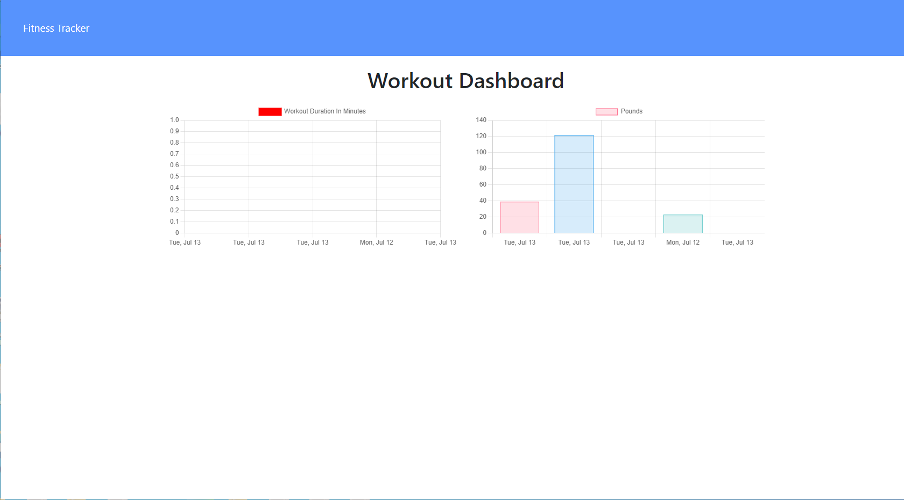

# tracker
# setting up  starting files (sever.js)
# Used seed.js file and workout.js in seeders folder to connect to mongoDB
# Set-up fitness model
# checked HTML and api routes
# Fixed other errors  in (STAT) to be able to deploy the page to heroku
# Deployed using Mongo Atlas

https://safe-temple-43382.herokuapp.com/exercise?id=60ed7ce2c954d60015fdc560

# Screen-Shot

 </img>